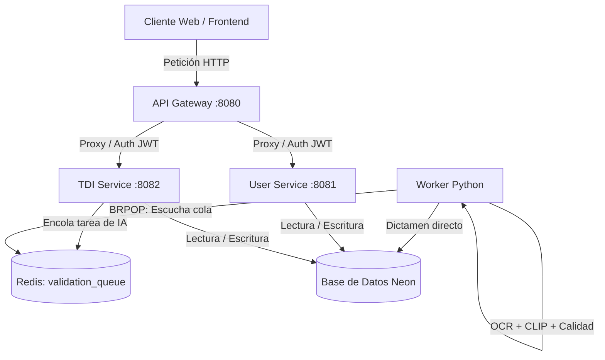
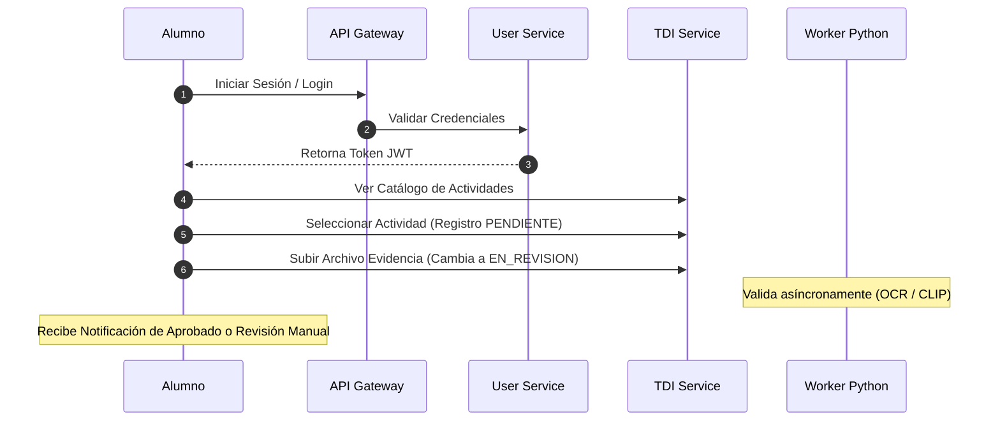
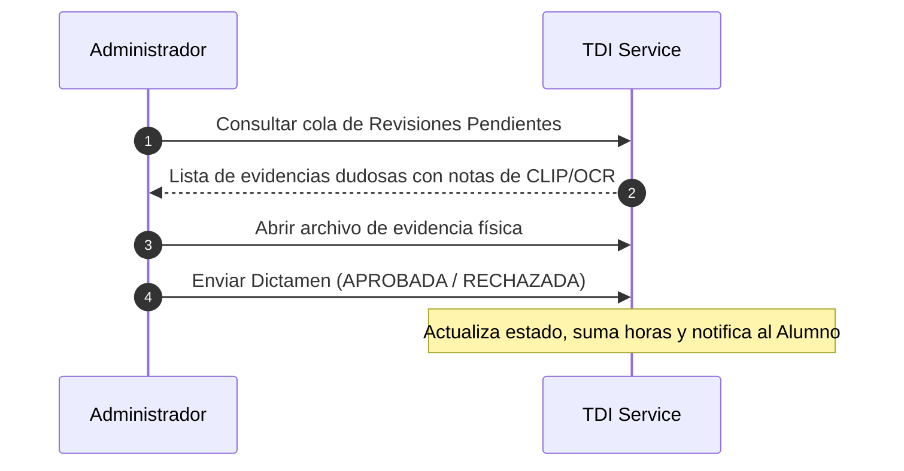

# Documentación del Backend: Endpoints, Flujos y Validaciones (Formación Integral - UTEQ)

Este documento centraliza el diseño arquitectónico, el catálogo completo de endpoints de la API, las reglas del motor de validación automática y los flujos de trabajo esperados para cada rol del sistema.

---

## 1. Arquitectura General y Flujo de Datos

El backend está diseñado bajo una arquitectura de microservicios coordinados por un **API Gateway** central, con colas de mensajería asíncronas en **Redis** y una base de datos **Neon Postgres** compartida.



---

## 2. Flujo de Trabajo por Rol

### A. Rol: Alumno
Es el estudiante que realiza actividades extracurriculares para acumular horas de formación integral.


### B. Rol: Administrativo / Coordinador
Personal docente o de servicios escolares que gestiona el catálogo y valida de forma manual las evidencias marcadas con advertencias.


---

## 3. Catálogo Completo de Endpoints

> [!NOTE]
> Todas las peticiones deben dirigirse al puerto del API Gateway: `http://localhost:8080`.
> Aquellas rutas marcadas con **(Protegido)** requieren la cabecera `Authorization: Bearer <TOKEN_JWT>`.

---

### A. Servicio de Usuarios y Autenticación (`/api/users`)

#### 1. Registrar Usuario
*   **Ruta**: `POST /api/users/register`
*   **Público**
*   **Cuerpo (JSON)**:
    ```json
    {
      "email": "alumno@uteq.edu.mx",
      "password": "miPasswordSeguro123",
      "nombre": "Juan",
      "apellido_paterno": "Pérez",
      "apellido_materno": "Gómez",
      "telefono": "4421234567",
      "role": "ALUMNO" // Opciones: ALUMNO, ADMINISTRATIVO, CREADOR_TDI, COORDINADOR
    }
    ```
*   **Respuesta Esperada (201 Created)**:
    ```json
    {
      "message": "usuario registrado con éxito"
    }
    ```

#### 2. Iniciar Sesión (Login)
*   **Ruta**: `POST /api/users/login`
*   **Público**
*   **Cuerpo (JSON)**:
    ```json
    {
      "email": "alumno@uteq.edu.mx",
      "password": "miPasswordSeguro123"
    }
    ```
*   **Respuesta Esperada (200 OK)**:
    ```json
    {
      "token": "eyJhbGciOi...",
      "user": {
        "id": "uuid-usuario",
        "email": "alumno@uteq.edu.mx",
        "nombre": "Juan",
        "role": "ALUMNO"
      }
    }
    ```

#### 3. Cerrar Sesión (Logout)
*   **Ruta**: `POST /api/users/logout` **(Protegido)**
*   **Respuesta Esperada (200 OK)**:
    ```json
    {
      "message": "sesión cerrada con éxito. El token ha sido invalidado"
    }
    ```

#### 4. Obtener Mi Perfil
*   **Ruta**: `GET /api/users/me` **(Protegido)**
*   **Respuesta Esperada (200 OK)**:
    ```json
    {
      "id": "uuid-usuario",
      "email": "alumno@uteq.edu.mx",
      "nombre": "Juan",
      "apellido_paterno": "Pérez",
      "role": "ALUMNO",
      "perfil_alumno": {
        "matricula": "202337153",
        "carrera": "TIDSM",
        "horas_acumuladas": 15
      }
    }
    ```

#### 5. Completar Perfil Académico (Alumno)
*   **Ruta**: `POST /api/users/alumnos/completar-perfil` **(Protegido)**
*   **Cuerpo (JSON)**:
    ```json
    {
      "matricula": "202337153",
      "grupo": "TI3-1",
      "carrera": "TIDSM",
      "cuatrimestre": 3,
      "tutor": "Ing. José Silva"
    }
    ```
*   **Respuesta Esperada (200 OK)**:
    ```json
    {
      "message": "perfil académico guardado con éxito"
    }
    ```

#### 6. Obtener Historial de Notificaciones
*   **Ruta**: `GET /api/users/notificaciones` **(Protegido)**
*   **Respuesta Esperada (200 OK)**:
    ```json
    [
      {
        "id": "uuid-notificacion",
        "titulo": "Evidencia Aprobada",
        "mensaje": "¡Felicidades! Tu evidencia para la actividad 'Congreso IA' ha sido aprobada.",
        "leida": false,
        "fecha": "2026-07-19T23:00:00Z"
      }
    ]
    ```

#### 7. Marcar Notificación como Leída
*   **Ruta**: `PUT /api/users/notificaciones/{id}/leer` **(Protegido)**
*   **Respuesta Esperada (200 OK)**:
    ```json
    {
      "message": "notificación marcada como leída con éxito"
    }
    ```

---

### B. Servicio de Actividades y Evidencias (`/api/tdi`)

#### 1. Listar y Filtrar Catálogo de Actividades
*   **Ruta**: `GET /api/tdi/catalogo`
*   **Parámetros query (Opcionales)**: `categoria_id`, `dimension_id`, `search` (buscador).
*   **Respuesta Esperada (200 OK)**:
    ```json
    [
      {
        "id": "uuid-actividad",
        "nombre": "Congreso de Inteligencia Artificial",
        "horas": 10,
        "puntaje": 5,
        "evidencia_requerida": "Constancia de participación oficial"
      }
    ]
    ```

#### 2. Seleccionar Actividad (Inscripción del Alumno)
*   **Ruta**: `POST /api/tdi/registro/seleccionar` **(Protegido)**
*   **Cuerpo (JSON)**:
    ```json
    {
      "catalogo_tdi_id": "uuid-actividad"
    }
    ```
*   **Respuesta Esperada (201 Created)**:
    ```json
    {
      "id": "uuid-registro-tdi",
      "alumno_id": "uuid-alumno",
      "estado": "PENDIENTE"
    }
    ```

#### 3. Subir Evidencia Física (Carga de Archivos)
*   **Ruta**: `POST /api/tdi/registro/{id}/subir-evidencia` **(Protegido)**
*   **Cuerpo**: Multipart/Form-Data con un campo llamado `archivo` (Extensiones: `.pdf`, `.png`, `.jpg`, `.jpeg`).
*   **Respuesta Esperada (200 OK)**:
    ```json
    {
      "message": "evidencia subida con éxito. Estado del registro cambiado a EN_REVISION",
      "nombre_archivo": "202337153.pdf",
      "mime_type": "application/pdf",
      "hash": "ca0a2923b2b...",
      "url_archivo": "/uploads/202337153.pdf"
    }
    ```

#### 4. Consultar Mis Actividades (Alumno)
*   **Ruta**: `GET /api/tdi/registro/mis-registros` **(Protegido)**
*   **Respuesta Esperada (200 OK)**:
    ```json
    [
      {
        "registro_id": "uuid-registro",
        "tdi_nombre": "Congreso de Inteligencia Artificial",
        "estado": "APROBADA",
        "horas_otorgadas": 10,
        "motivo_rechazo": ""
      }
    ]
    ```

#### 5. Consultar Progreso de Horas/Puntos (Alumno)
*   **Ruta**: `GET /api/tdi/alumnos/progreso` **(Protegido)**
*   **Respuesta Esperada (200 OK)**:
    ```json
    {
      "meta_puntos": 200,
      "puntos_acumulados": 15,
      "dimensiones": [
        {
          "dimension": "Intelectual",
          "puntos_acumulados": 10,
          "porcentaje": 5.0
        }
      ]
    }
    ```

#### 6. Listar Evidencias en Revisión (Administrativos)
*   **Ruta**: `GET /api/tdi/revisiones/pendientes` **(Protegido)**
*   **Headers requeridos**: `X-User-Role` con valor `ADMINISTRATIVO`, `CREADOR_TDI` o `COORDINADOR`.
*   **Respuesta Esperada (200 OK)**:
    ```json
    [
      {
        "revision_id": "uuid-revision",
        "registro_tdi_id": "uuid-registro",
        "nombre": "Juan Pérez",
        "matricula": "202337153",
        "tdi_nombre": "Conferencia Reforestación",
        "evidencia_url": "/uploads/202337153.jpg",
        "ocr_observaciones": "Revisión requerida: CLIP detectó 58% de coincidencia."
      }
    ]
    ```

#### 7. Dictaminar Evidencia Manualmente (Administrativos)
*   **Ruta**: `POST /api/tdi/revisiones/{id}/dictamen` **(Protegido)**
*   **Headers requeridos**: `X-User-Role` con valor administrativo.
*   **Cuerpo (JSON)**:
    ```json
    {
      "decision": "APROBADA", // Opciones: APROBADA, RECHAZADA
      "comentario": "Se confirma firma del tutor en el documento."
    }
    ```
*   **Respuesta Esperada (200 OK)**:
    ```json
    {
      "message": "dictamen de evidencia guardado con éxito"
    }
    ```

---

## 4. El Motor de Validación IA (Las 4 Capas)

Cuando se sube una evidencia, el Worker en Python ejecuta las siguientes capas de seguridad:

### Capa 1: Validación Estructural
El nombre físico del archivo se restringe estrictamente a `MATRICULA.extension`. Si es un PDF, el worker lo convierte automáticamente en imágenes a resolución moderada (150 DPI) para analizarlo visualmente.

### Capa 2: Anti-Plagio y Calidad
*   **Hash SHA-256**: Se calcula la huella digital del archivo. Si coincide con una evidencia que ya subió otro alumno, el registro se marca como **`RECHAZADA`** automáticamente por intento de plagio.
*   **Detección de Desenfoque (Laplacian Variance)**: Aplica una máscara del Laplaciano sobre la imagen usando OpenCV. Si la varianza matemática de contraste es menor a **`80.0`**, significa que el documento está borroso o es ilegible. Se detiene el proceso y se turna a **Revisión Manual**.

### Capa 3: Verificación Semántica Visual (CLIP de OpenAI)
*   Se carga localmente un modelo preentrenado de **CLIP** en CPU (`clip-vit-base-patch32`).
*   Se compara visualmente cada página/imagen contra el prompt descriptivo del catálogo (ej. *"a photo representing Congreso de Inteligencia Artificial"*).
*   Si la similitud visual calculada es menor al **`70%`**, la IA sospecha que subieron una imagen incorrecta (ej: la foto de un árbol para un taller de cómputo, o viceversa) y lo deriva a **Revisión Manual**.

### Capa 4: Identidad y OCR (Tesseract)
*   Se extrae el texto del documento.
*   Se normaliza (remueve acentos, mayúsculas y caracteres especiales).
*   Busca la presencia explícita del **Nombre Completo del Alumno** y su **Matrícula** en el texto. Si no los encuentra, la validación falla por falta de identidad y se manda a **Revisión Manual** para seguridad.
*   Busca palabras clave de la UTEQ y de la actividad para asegurar la pertenencia institucional.
